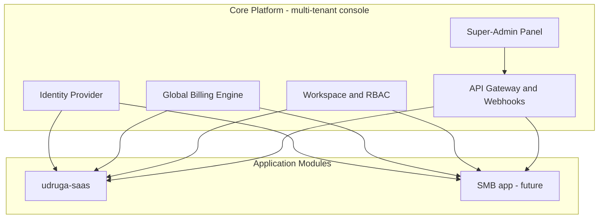
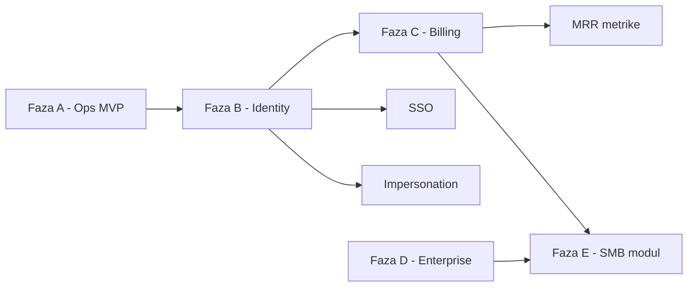

# Roadmap: Multi-SaaS Core Platforma

Dokument opisuje put od trenutnog **Super-Admin konzola + modul (udruga-saas)** do **centralizirane Core platforme** prema konačnoj specifikaciji.

**Verzija:** 1.0  
**Datum:** 14. 07. 2026.  
**Repozitoriji:**
- Core / konzola: `multi-tenant console` (port 8001)
- Prvi modul: `udruga-saas` (port 8000)

---

## 1. Vizija

Core platforma rješava infrastrukturu i poslovne potrebe koje su zajedničke svim SaaS aplikacijama:

- **Identity & Access** — jedan korisnički račun, više organizacija, SSO, MFA
- **Global Billing** — paketi, Stripe, dunning, self-service
- **Teaming** — workspace, pozivnice, RBAC profili po aplikaciji
- **Platform Ops** — admin panel, audit, metrike, impersonation, feature flags

Pojedine aplikacije (Udruge, SMB) su **moduli** koji se spajaju na Core preko API-ja i ne dupliciraju auth/billing logiku.

### Ciljna arhitektura

---

## 2. Trenutno stanje (Faza A — gotovo)

| Područje | Status | Napomena |
|----------|--------|----------|
| Multi-app konzola | ✅ | CRUD aplikacija, app switcher |
| Tenant registry | ✅ | Sync + webhook, status/plan push |
| Plan catalog | ✅ | basic / standard / premium, sync API |
| Plan enforcement | ✅ | udruga-saas: limiti, web značajke |
| Tenant moderacija | ✅ | Approve, suspend, bulk, audit |
| Super-admin 2FA | ✅ | Obavezni TOTP |
| Deploy scaffolding | ✅ | Docker, DEPLOY.md, dev skripte |
| Jedinstveni IdP | ❌ | Odvojeni login u konzoli i modulu |
| Global billing | ✅ | Stripe, dunning, self-service, MRR |
| Tenant audit | ❌ | Schema u modulu, nema pisanja |
| SSO / GDPR | ⚠️ | GDPR export (D-S3); SSO u tijeku |
| Impersonation / feature flags | ❌ | Nema |
| SaaS metrike (MRR/Churn) | ❌ | Samo brojanje tenanata |

**Procjena pokrivenosti specifikacije:** ~25–30% (ops i plan catalog solidni; Core identity i billing nedostaju).

---

## 3. Faze razvoja

### Pregled

| Faza | Naziv | Trajanje (procjena) | Ishod |
|------|-------|---------------------|-------|
| **A** | Ops MVP | ✅ Gotovo | Konzola + sync s udruga-saas |
| **B** | Core Identity & Support | 4–6 tjedana | Centralni auth, audit, invite, impersonation |
| **C** | Global Billing | 6–10 tjedana | Stripe, dunning, self-service, MRR |
| **D** | Enterprise & Scale | 8–12+ tjedana | SSO, GDPR, customer webhooks, observability |
| **E** | Drugi modul (SMB) | 12+ tjedana | Nova aplikacija na istom Core-u |

---

## Faza B — Core Identity & Support

**Cilj:** Korisnik i support tim imaju jedinstveno iskustvo; modul prestaje biti izvor istine za identitet.

### Epic B1: Centralni Identity Provider

| ID | Task | Opis | Prioritet |
|----|------|------|-----------|
| B1.1 | `users` u Core-u | Core postaje izvor istine za korisničke račune (email, lozinka, MFA) | P0 |
| B1.2 | JWT / session bridge | Modul validira token iz Core-a umjesto vlastitog `users` za platformu | P0 |
| B1.3 | Unified login UI | Jedna prijava → redirect u aktivnu org/modul | P0 |
| B1.4 | Migracija postojećih usera | Skripta: udruga-saas `users` → Core `users` + mapiranje | P0 |
| B1.5 | MFA za tenant korisnike | Opcionalna TOTP u Core-u, enforce po aplikaciji/org | P1 |

**Acceptance criteria:**
- Korisnik se prijavljuje jednom i pristupa udruga-saas bez drugog login ekrana
- Core API: `POST /api/auth/login`, `GET /api/auth/me`, `POST /api/auth/logout`
- Postojeći testni korisnici migrirani bez gubitka pristupa

### Epic B2: Workspace & pozivnice

| ID | Task | Opis | Prioritet |
|----|------|------|-----------|
| B2.1 | `organization_memberships` u Core | Veza user ↔ tenant ↔ uloga | P0 |
| B2.2 | Invite model + token | Email, uloga, rok trajanja, jednokratni token | P0 |
| B2.3 | Invite email + accept flow | `/invite/{token}` → registracija ili povezivanje računa | P0 |
| B2.4 | Workspace switcher iz Core-a | API lista org za usera; modul koristi Core podatke | P1 |
| B2.5 | RBAC profili po aplikaciji | Core: uloga + `application_id`; modul mapira na PermissionKeys | P1 |

**Acceptance criteria:**
- Admin udruge može pozvati člana e-mailom s definiranom ulogom
- Istekli/nevaljani token odbijen
- Korisnik s 2+ org vidi switcher

### Epic B3: Tenant audit (operativno)

| ID | Task | Opis | Prioritet |
|----|------|------|-----------|
| B3.1 | `AuditLog` model u udruga-saas | Aktivirati postojeću migraciju | P0 |
| B3.2 | Audit middleware / observer | Bilježi create/update/delete na ključnim modelima | P0 |
| B3.3 | Audit UI u modulu | Vlasnik vidi zapisnik u postavkama | P1 |
| B3.4 | Sync audit u Core (opcionalno) | Agregirani pregled u konzoli po tenantu | P2 |

**Ključni modeli za audit:** Member, Payment, Organization settings, Event, FinanceDocument.

### Epic B4: Impersonation (support)

| ID | Task | Opis | Prioritet |
|----|------|------|-----------|
| B4.1 | `impersonation_sessions` | Super-admin, tenant, razlog, started_at, expires_at | P1 |
| B4.2 | „Uđi kao tenant” u konzoli | Generira signed token, redirect u modul | P1 |
| B4.3 | Audit impersonation | Svaki ulaz/izlaz zabilježen | P1 |
| B4.4 | Vizualni banner u modulu | „Support sesija — {admin}” | P1 |

**Acceptance criteria:**
- Super-admin može otvoriti tenant bez lozinke korisnika
- Sve akcije u impersonation sesiji imaju `impersonated_by` u audit logu

### Faza B — predloženi sprintovi (2 tjedna)

| Sprint | Fokus | Deliverables |
|--------|-------|--------------|
| B-S1 | B1.1, B1.2, B1.4 | Core users + JWT; migracija usera | ✅ Gotovo |
| B-S2 | B1.3, B1.5 | Unified login; tenant MFA (opcionalno) | 🟡 U tijeku |
| B-S3 | B2.1, B2.2, B2.3 | Invite flow end-to-end |
| B-S4 | B2.4, B2.5, B3.1–B3.2 | Workspace API; audit pisanje |
| B-S5 | B3.3, B4.* | Audit UI; impersonation |

---

## Faza C — Global Billing Engine

**Cilj:** Naplata SaaS pretplate centralizirana u Core-u; modul samo enforcea plan i feature gate.

### Epic C1: Stripe integracija

| ID | Task | Opis | Prioritet |
|----|------|------|-----------|
| C1.1 | Stripe account + env | Test/prod ključevi u Core postavkama | P0 |
| C1.2 | `subscriptions` tablica | tenant_id, stripe_subscription_id, status, period | P0 |
| C1.3 | Mapiranje plan ↔ Stripe Price | basic/standard/premium → Price ID | P0 |
| C1.4 | Checkout / Customer Portal | Stripe Checkout za upgrade; Portal za upravljanje | P0 |
| C1.5 | Webhook handler | `invoice.paid`, `customer.subscription.updated`, itd. | P0 |

### Epic C2: Dunning & lifecycle

| ID | Task | Opis | Prioritet |
|----|------|------|-----------|
| C2.1 | Failed payment retry | Stripe smart retries + custom schedule (3/5/7 dana) | P0 |
| C2.2 | Email podsjetnici | Automatizirani mailovi pri neuspjehu | P0 |
| C2.3 | Auto-suspend / downgrade | Nakon 14 dana: suspend tenant ili downgrade na basic | P0 |
| C2.4 | Proration | Upgrade usred ciklusa — Stripe proration | P1 |
| C2.5 | Trial period | Konfigurabilni trial po aplikaciji | P2 |

### Epic C3: Self-service & metrike

| ID | Task | Opis | Prioritet |
|----|------|------|-----------|
| C3.1 | Self-service portal u modulu | Promjena paketa, preuzimanje računa, kartice | P0 |
| C3.2 | Sync plan iz Stripe u modul | Core push plan/status nakon webhooka | P0 |
| C3.3 | MRR dashboard u konzoli | Mjesečni recurring revenue po aplikaciji | P1 |
| C3.4 | Churn & LTV | Osnovne metrike iz Stripe + tenant lifecycle | P2 |
| C3.5 | Per-seat / usage (future) | Broj aktivnih korisnika ili SMS/uplatnice | P3 |

### Epic C4: Dokumenti po vertikali (modul)

| ID | Task | Opis | Prioritet |
|----|------|------|-----------|
| C4.1 | Udruge: članarine PDF | Već djelomično u modulu — povezati s planom | P2 |
| C4.2 | SMB: računi + PDV | Finance modul proširiti za SMB spec | P3 |

**Napomena:** C4 ostaje u **modulu**; Core drži samo SaaS pretplatu, ne tenant accounting.

### Faza C — predloženi sprintovi

| Sprint | Fokus | Deliverables |
|--------|-------|--------------|
| C-S1 | C1.1–C1.3 | Stripe setup, subscription model | ✅ |
| C-S2 | C1.4–C1.5 | Checkout + webhooks | ✅ |
| C-S3 | C2.1–C2.3 | Dunning + auto-suspend | ✅ |
| C-S4 | C2.4, C3.1–C3.2 | Proration; self-service UI | ✅ |
| C-S5 | C3.3–C3.4 | MRR/Churn dashboard | ✅ |

---

## Faza D — Enterprise & Scale

**Cilj:** Ozbiljni SMB i enterprise kupci; operativna zrelost platforme.

### Epic D1: SSO

| ID | Task | Opis | Prioritet |
|----|------|------|-----------|
| D1.1 | Google OAuth | Laravel Socialite | P1 | ✅ (D-S2) |
| D1.2 | Microsoft 365 / Azure AD | OIDC | P1 | ✅ (D-S4) |
| D1.3 | Apple Sign In | P2 |
| D1.4 | SSO po organizaciji | Enforce SSO za odabrane tenant-e | P2 |

### Epic D2: GDPR & compliance

| ID | Task | Opis | Prioritet |
|----|------|------|-----------|
| D2.1 | Data export (JSON/CSV) | User + org podaci na zahtjev | P1 | ✅ (D-S3) |
| D2.2 | Right to erasure | Workflow brisanja s grace periodom | P1 | ✅ (D-S5) |
| D2.3 | Consent & privacy policy | Verzionirani consent u Core | P2 |
| D2.4 | Session management UI | Aktivni uređaji, odjava svih | P2 |

### Epic D3: Extensibility & DevOps

| ID | Task | Opis | Prioritet |
|----|------|------|-----------|
| D3.1 | Customer webhooks | Tenant registrira URL; eventi `member.created`, `invoice.paid` | P1 | ✅ (D-S1) |
| D3.2 | API Gateway / versioning | `/api/v1/...`, OpenAPI spec | P1 | ✅ (D-S4) |
| D3.3 | Feature flags | Runtime toggles po tenant/user (beta) | P2 |
| D3.4 | Sentry / error tracking | Backend + frontend | P1 |
| D3.5 | Status page | Javni uptime + incident history | P2 |
| D3.6 | Zero-downtime deploy | Blue-green ili rolling (Docker) | P2 |

### Epic D4: Konzola — proširenja

| ID | Task | Opis | Prioritet |
|----|------|------|-----------|
| D4.1 | Upravljanje super-admin korisnicima | CRUD, dodjela uloga | P1 | ✅ (D-S5) |
| D4.2 | Prošireni audit | App CRUD, settings, 2FA promjene | P2 |
| D4.3 | Vođeni onboarding (modul) | Interaktivni tour prve prijave | P2 |

### Faza D — predloženi sprintovi

| Sprint | Fokus | Deliverables |
|--------|-------|--------------|
| D-S1 | D3.1 | Customer webhooks (subscribe, dispatch, HMAC) | ✅ |
| D-S2 | D1.1 | Google OAuth (Socialite) | ✅ |
| D-S3 | D2.1 | GDPR data export | ✅ |
| D-S4 | D1.2, D3.2 | Microsoft OIDC + API v1 | ✅ |
| D-S5 | D2.2, D4.1 | Erasure workflow + super-admin CRUD | ✅ |

---

## Faza E — Drugi modul (SMB)

**Preduvjet:** Faze B, C i D stabilne za udruga-saas.

| ID | Task | Opis | Status |
|----|------|------|--------|
| E1 | Nova `Application` u konzoli | SMB slug, sync driver | ✅ (E-S1) |
| E2 | SMB Laravel app | Isti Core auth + billing API | 🔄 (E-S1 scaffold) |
| E3 | SMB RBAC profili | Vlasnik, prodaja, računovođa | |
| E4 | SMB dokumenti | Računi, PDV, opcionalno fiskalizacija | |

### Faza E — predloženi sprintovi

| Sprint | Fokus | Deliverables |
|--------|-------|--------------|
| E-S1 | E1, E2 (scaffold) | SMB Application u konzoli + `smb-saas` modul (sync API, Core auth) | ✅ |
| E-S2 | E2, E3 | Registracija tvrtke, RBAC profili | |
| E-S3 | E4 | Računi i PDV modul | |

---

## 4. Ovisnosti između faza

**Pravilo:** Ne krećati Stripe (C) prije stabilnog centralnog auth-a (B1), jer subscription mora biti vezan uz Core `user_id` / `tenant_id`.

---

## 5. Prioriteti (što prvo)

| # | Akcija | Zašto |
|---|--------|-------|
| 1 | **Produkcijski deploy Faze A** | MVP mora raditi end-to-end prije nove arhitekture |
| 2 | **B1 Centralni IdP** | Temelj cijele specifikacije |
| 3 | **C1 Stripe + webhooks** | Bez naplate nema održivog SaaS-a |
| 4 | **B3 Tenant audit** | Compliance i support |
| 5 | **B4 Impersonation** | Brži support bez lozinki |
| 6 | **B2 Pozivnice** | Rast timova u org |
| 7 | **D1 SSO** | Enterprise sales |
| 8 | **D2 GDPR** | EU tržište |

---

## 6. Mjerila uspjeha (KPI po fazi)

| Faza | KPI |
|------|-----|
| A | Registracija → webhook → odobrenje → pristup &lt; 5 min; sync success rate &gt; 99% |
| B | 100% novih usera kroz Core login; invite accept rate mjerljiv |
| C | &gt; 80% upgrade-a kroz self-service; dunning recovery rate; MRR vidljiv u konzoli |
| D | SSO adoption %; GDPR request SLA &lt; 30 dana; error MTTR &lt; 4 h |
| E | SMB modul na istom Core auth/billing bez fork-a logike |

---

## 7. Izvan scope-a (namjerno odgođeno)

- Native mobilne aplikacije
- Multi-region / multi-DB sharding
- Vlastiti payment processor (izvan Stripea)
- Fiskalizacija u Core-u (ostaje u modulu po vertikali)
- White-label custom domene za Core admin (modul već ima custom domain za javni web)

---

## 8. Tehnički dug (popraviti uz Fazu B)

| Stavka | Lokacija | Akcija |
|--------|----------|--------|
| Duplicirani `users` | udruga-saas + konzola | Migracija u Core |
| Audit schema bez pisanja | udruga-saas migracija | B3.1–B3.2 |
| Stripe kolone nekorištene | `organizations.stripe_*` | Premjestiti u Core `subscriptions` |
| README konzole | generic Laravel | Zamijeniti project-specific docs |
| Legacy CSV / storage u gitu | udruga-saas commit | `.gitignore` + cleanup commit |

---

## 9. Reference

| Dokument | Svrha |
|----------|-------|
| [DEPLOY.md](./DEPLOY.md) | Produkcijski deploy |
| [deploy/README.md](./deploy/README.md) | Docker lokalno |
| Konačna specifikacija | Identity, Billing, UX, DevOps (chat 14. 07. 2026.) |

---

## 10. Changelog ovog dokumenta

| Verzija | Datum | Promjena |
|---------|-------|----------|
| 1.0 | 14. 07. 2026. | Inicijalni roadmap nakon usporedbe specifikacije s implementacijom |

---

*Za ažuriranje: nakon svake faze označiti taskove u tablicama i dodati red u Changelog.*
